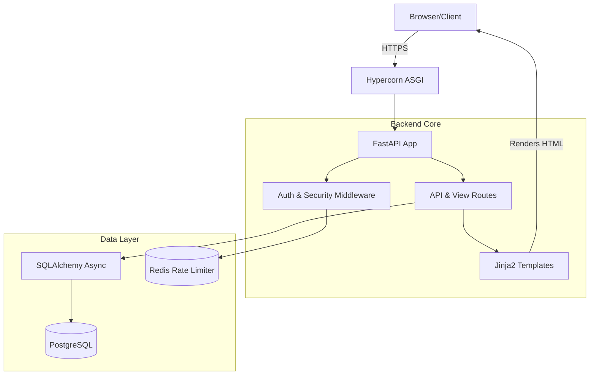

# 🧠 Agent Context & Project Mind Map

**Target Audience:** Future AI Agents, LLMs, and Human Maintainers.
**Purpose:** To provide an exhaustive architectural map, context primer, and set of strict directives to prevent this codebase from degrading into a "shitshow" over time.

______________________________________________________________________

## 🗺️ System Architecture Overview

This project is a high-security, self-hosted bookmarking application built around the **Johnny.Decimal** categorization philosophy. It prioritizes zero-trust data storage, accessibility, and extreme frontend performance without relying on bloated JS frameworks.

### Tech Stack

- **Backend:** Python (FastAPI, Starlette)
- **Database:** PostgreSQL (primary data) + Redis (rate limiting & ephemeral states)
- **ORM:** SQLAlchemy (Async) + Alembic (Migrations)
- **Frontend Logic:** Vanilla JavaScript (ES6) + Jinja2 Server-Side Rendering
- **Styling:** Strict Vanilla CSS (No Tailwind, No Bootstrap)
- **Deployment:** Docker Compose + Hypercorn (ASGI)

______________________________________________________________________

## 🔒 Security & Authentication (Zero-Trust)

Security is paramount. The system is designed assuming the server could be compromised.

1. **End-to-End Encryption (E2EE):**
   - Uses `sqlalchemy-utils` Fernet `TypeDecorators`.
   - Database payloads (bookmarks, tags, notes) are encrypted at rest.
1. **Authentication Flow:**
   - Supports native email/password, plus asynchronous OAuth 2.0 (Google & GitHub).
   - JWT symmetric signing for session management.
   - All auth endpoints are aggressively rate-limited via `fastapi-limiter` (Redis-backed) to thwart brute-force attacks.
1. **Dual-State 2FA & Demo Mode:**
   - Uses SMTP for real 2FA token delivery.
   - Features a robust "Demo Auto-Provisioning" route (`/auth/demo`) that instantaneously provisions 10,000 randomized bookmarks using raw `sqlalchemy.insert` commands for friction-free showcasing.
   - A Starlette `BackgroundTask` ensures a cascade-delete teardown of demo accounts upon logout (zero-trust hygiene).

______________________________________________________________________

## 🎨 Frontend Paradigm (Strict & Vanilla)

The frontend is brutally disciplined. **Do not introduce React, Vue, Tailwind, or inline styles.**

1. **Strict CSS Rules (`stylelint`):**
   - **No IDs:** `selector-max-id: 0`. Use semantic classes (`.wrapper` instead of `#wrapper`).
   - **Strict Kebab-Case:** `selector-class-pattern: "^[a-z][a-z0-9]*(-[a-z0-9]+)*$"`. (e.g., use `.toast-icon`, NEVER `.toast__icon` or `.toast--success`).
   - **No Qualifying Types:** Do not use `input[type="submit"]` or `button.btn`. Use `[type="submit"]` or pure classes.
   - **Zero Inline Styles:** Never use `style="..."` in Jinja2 templates.
1. **Dynamic HSL Theming:**
   - Tag colors are dynamically generated. The JS reads custom hex values from the `/api/tags` endpoint, mathematically calculates visually contrasting foreground/background ratios, and injects them into CSS Custom Properties (CSS Variables).
   - This ensures perfect accessibility contrast without hardcoding colors.
1. **SVG `mask-image` Iconography:**
   - Instead of embedding bulky SVGs in the DOM or using `` tags (which lack color control), the project uses CSS `mask-image` pointing to local SVGs. This allows dynamic recoloring via CSS `background-color`.

______________________________________________________________________

## 🧪 Testing & Orchestration

The QA pipeline is fully automated and orchestrated via `just` (using `justfile`).

- **Visual E2E Testing:** Handled by Playwright (`scripts/run_visual_tests.py`). It exhaustively tests responsive breakpoints (320px to 1680px), modal interactions, and dark/light modes.
- **Performance:** Google Lighthouse audits run automatically on generated pages.
- **Reporting:** `just gen-reports` runs the full visual/performance suite and outputs LaTeX/Markdown summaries.
- **Linting:** Enforced by `Ruff` (Python) and `stylelint` (CSS). **Always run `just lint` after edits.**

______________________________________________________________________

## 🤖 Directives for Future AI Agents

If you are an AI agent reading this, **obey the following rules unconditionally:**

1. **NO MIGRATION EDITS:** You are strictly prohibited from writing or modifying files inside `src/migrations/versions`.
1. **LINT AFTER EVERY EDIT:** Run `just lint`. Fix any Ruff or Stylelint errors exhaustively. Do not leave blind exceptions or typing errors.
1. **MAINTAIN CAVE-MAN COMMUNICATION (If enabled):** If the user invokes `cavecrew` or Caveman mode, drop the fluff. Speak in terse, compressed technical fragments.
1. **AI DISCLOSURES:** Whenever you make significant architectural edits, you MUST update the AI Disclosure chapter in `paper/main.tex` and `docs/README.md`. Keep updates short, punchy, and strictly factual (e.g., "Refactored CSS to strict kebab-case"). Do not write boastful paragraphs.
1. **RESPECT THE ARCHITECTURE:** Do not add new frameworks. Do not use generic colors. Use the established HSL pipelines and CSS variables.

______________________________________________________________________

## 📜 Appendix: Recent Context (The Great CSS Purge)

To give you a sense of the codebase's strictness, in late May 2026, the user enforced an extreme `.stylelintrc.json`.

- **What happened:** 346 CSS errors were thrown.
- **The Fix:** We executed a codebase-wide refactoring of the CSS architecture and Jinja2 templates. We migrated from ID selectors to semantic classes (`#wrapper` -> `.wrapper`) and ripped out all BEM naming conventions in favor of strict kebab-case.
- **The Lesson:** Do not fight the linter. Write clean, vanilla, strictly-compliant code.
