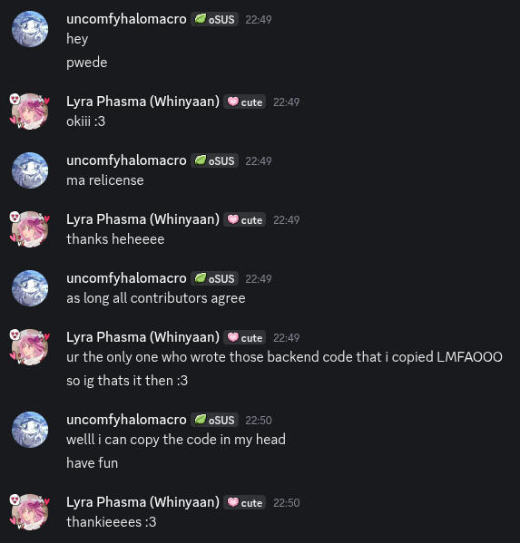

# License

Copyright (c) 2026 Lyra Phasma

This repository is dual-licensed:

- All files under `src` are licensed under the Lyra Phasma Academic
  Source License (LPASL) v1.0 (see [`docs/LICENSES/LPASL-1.0.md`](./LICENSES/LPASL-1.0.md))

- Everything else is licensed under the MIT License
  (see [`docs/LICENSES/MIT.md`](./LICENSES/MIT.md))

## Third-Party Attributions and Licensing History

### Pebble Recall by Team Phasmolysis

Parts or the entirety of the following files are derived from
[Pebble Recall by Team Phasmolysis](https://github.com/phasmolysis-team/phasmolysis-pebble-recall),
originally authored solely by uncomfyhalomacro:

- All files under `src/security`
- `src/api/auth.py`
- `src/config/settings.py`
- `src/middlewares/auth.py`
- `src/models/cookies.py`
- `src/models/users.py`
- `.direnvrc.uv`
- `.envrc`
- `alembic.ini`
- `justfile`

#### Licensing History of Mentioned Files for Transparency

1. **Originally MPL 2.0** — the above files were originally published under the Mozilla Public License 2.0 by uncomfyhalomacro as part of Pebble Recall.

1. **Relicensed to LPASL v1.0** — uncomfyhalomacro, as the sole author and copyright holder of the derived code, granted explicit written permission to relicense the above files under the LPASL v1.0. Evidence of this consent is preserved in [`docs/LICENSES/relicense-consent.png`](./LICENSES/relicense-consent.png).

   
