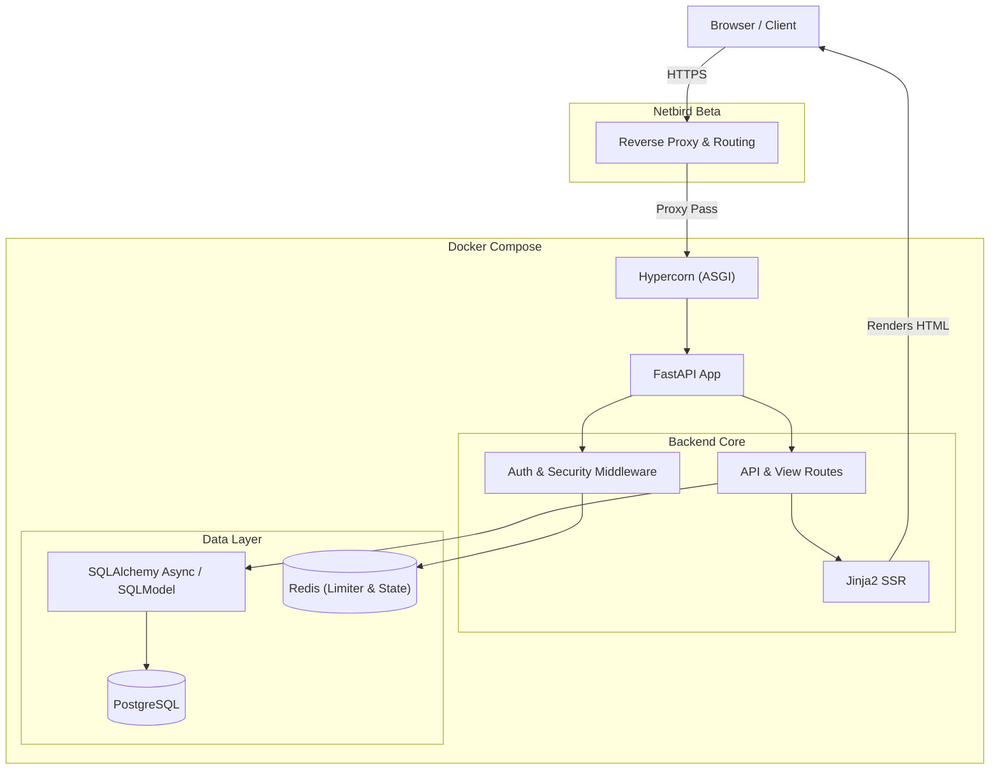
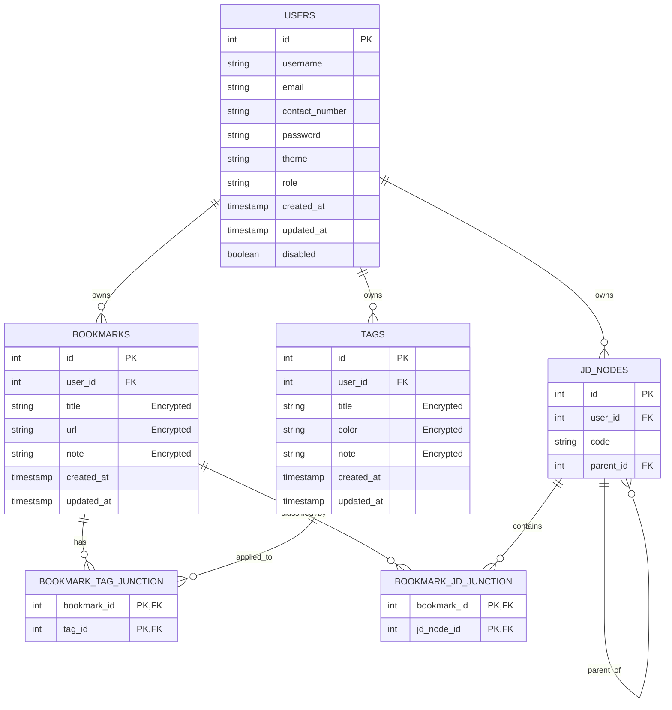

# DeciMark

DeciMark is a server-rendered bookmark manager built around Johnny.Decimal identifiers, tags, and user-owned bookmark records.

## Stack

- **FastAPI** — request routing, dependency injection, and API endpoints. Chosen for its raw ASGI performance, built-in Pydantic validation, and automatic OpenAPI schema generation.
- **SQLModel** — shared database and schema models. Allows utilizing the power of SQLAlchemy while writing concise Pydantic-compatible type hints.
- **PostgreSQL** — durable relational storage and many-to-many bookmark relations. Provides ACID compliance and robust relational integrity.
- **Jinja2** — server-rendered HTML pages. Allows zero-JS functional baseline rendering for ultimate resilience.
- **Vanilla JavaScript** — progressive enhancement without a client SPA framework. Keeps the application hyper-lightweight by executing interactivity strictly via raw DOM manipulation and the Fetch API, sidestepping heavy client-side bundle costs.
- **Hypercorn** — ASGI server used by `just dev` and `just run`. Selected for HTTP/2 support and high asynchronous throughput.
- **Playwright** — browser automation for visual and end-to-end checks. Provides cross-browser rendering accuracy for UI regression testing.
- **Docker Compose** — local Postgres and Redis orchestration. Eliminates manual binary dependencies for local development.

## Setup

For the main app server:

```bash
just run
```

Use the repository commands:

```bash
just start-db
just start-redis
just tests
just lint
just gen-reports
just dev
```

For migrations:

```bash
just alembic upgrade head
```

For test database migration checks:

```bash
just test-migrations
```

## Runtime dependencies

`just dev` and `just run` expect Docker Compose services for:

- PostgreSQL
- Redis

The lint and report recipes also depend on external tools installed in the environment:

- `uv`
- `black`
- `ruff`
- `djlint`
- `mdformat`
- `tex-fmt`
- `npx`
- `latexmk`
- `playwright`
- `hypercorn`

## Justfile recipe reference

### Public recipes

| Recipe | Purpose | Dependencies |
| --- | --- | --- |
| `default` | Lists available recipes | none |
| `optimize_images` | Runs `scripts/optimize_images.sh` | shell utilities |
| `gen_blog` | Runs `node blog.js` | Node.js, project script |
| `screenshot` | Runs `node screenshot.js` with Chromium path set | Node.js, Chromium, project script |
| `build_tex doc` | Builds the selected LaTeX file with `latexmk` | `latexmk`, XeLaTeX, BibTeX |
| `build` | Runs image optimization, blog generation, screenshots, and paper build | all build dependencies |
| `tests +args=""` | Runs the pytest suite through `uv` | `uv`, pytest |
| `test-migrations` | Verifies Alembic upgrade/downgrade on a test database | Docker Compose, Alembic |
| `alembic +args` | Runs Alembic commands through `uv` | `uv`, Alembic |
| `stop-redis` | Stops Redis in Docker Compose | Docker Compose |
| `start-redis` | Restarts Redis in Docker Compose | Docker Compose |
| `stop-db` | Stops PostgreSQL in Docker Compose | Docker Compose |
| `start-db` | Restarts PostgreSQL in Docker Compose | Docker Compose |
| `create-db-user` | Creates the database superuser in the DB container | Docker Compose, `psql` |
| `create-db` | Creates the main application database if missing | Docker Compose, `psql` |
| `drop-db` | Drops the main application database | Docker Compose, `psql` |
| `create-test-db` | Creates the test database if missing | Docker Compose, `psql` |
| `drop-test-db` | Drops the test database | Docker Compose, `psql` |
| `lint` | Runs Python, CSS, JS, HTML, Jinja2, Markdown, and TeX linting/formatting | tools listed above |
| `seed` | Seeds demo data | `uv`, `scripts/seed.py` |
| `gen-reports` | Regenerates CSS/Python summaries, SCC report, visual tests, and docs/TeX lint outputs | Docker Compose, `uv`, `tex-fmt`, Playwright |
| `dev` | Starts app with reload on port 8000 | Docker Compose, `uv`, Hypercorn |
| `run` | Starts app with reload and 16 workers on port 8000 | Docker Compose, `uv`, Hypercorn |

### Private helper recipes

These recipes are internal support only and are not part of the public operator surface:

- `nio_scripts`
- `nio_src`
- `ruff_scripts`
- `ruff_src`
- `lint-js`
- `lint-css`
- `format-css`
- `lint-html`
- `lint-jinja`
- `lint-md`
- `lint-tex`
- `restart-web-deps`

## Architecture & Technology Stack

The architecture of DeciMark is engineered for extreme performance, absolute zero-trust security, and unyielding frontend discipline. By rejecting industry trends of bloated Single Page Applications (SPAs) and heavy JavaScript frameworks, the system achieves near-instantaneous load times and perfect accessibility metrics.

### System Flow



### Dependency Rationale

- **FastAPI / Starlette**: Selected for its unparalleled asynchronous performance and native Pydantic integration, establishing an impregnable, type-safe validation boundary at the absolute edge of the network.
- **SQLModel / SQLAlchemy Async**: Unifies the persistence layer with Pydantic validation, completely eradicating traditional ORM boilerplate while aggressively executing high-throughput PostgreSQL queries in asynchronous non-blocking loops.
- **Jinja2**: Server-Side Rendering (SSR) bypasses the sheer computational weight of modern JavaScript engines. It forces the server to compute the DOM state and serves statically compiled HTML over the wire, optimizing Lighthouse scores perfectly.
- **Redis & fastapi-limiter**: Acts as an ephemeral, lightning-fast in-memory state store, enforcing ruthless rate-limiting across all authentication vectors to nullify brute-force intrusion attempts.
- **Docker Compose & Hypercorn**: Guarantees an identical, highly reproducible orchestration environment across both development and production. Hypercorn provides robust ASGI scaling across multiple underlying worker processes for maximum concurrency.
- **Vanilla CSS (Strict Kebab-Case) & No Tailwind**: A deliberate rejection of utility-class frameworks. The project enforces extreme CSS architectural discipline through `stylelint` (`selector-max-id: 0`), proving that bespoke, finely-tuned CSS dramatically outperforms bloated pre-compiled stylesheets.

## Database Schema & Zero-Trust Integrity

The database is built on PostgreSQL, utilizing deeply nested junction tables and precise primary/foreign key cascading to permanently eradicate orphan rows across millions of potential permutations.



**End-to-End Encryption (E2EE):** Sensitive payloads (`bookmarks.url`, `bookmarks.title`, `tags.title`) are aggressively encrypted at rest using `sqlalchemy-utils` Fernet TypeDecorators. Even in the event of a total database breach, the extracted SQL dumps are mathematically useless to the attacker.

## Deployment Strategy

Deployment is ruthlessly efficient, eliminating configuration drift through containerization and modern overlay networking.

1. **Environment Provisioning**: Define the cryptographic state and database credentials inside `.env.docker`, including the critically vital `DB_ENCRYPTION_KEY`.
1. **Container Orchestration**: Execute `docker-compose up -d --build`. This automatically provisions isolated networks for the Hypercorn workers, PostgreSQL, and Redis cache.
1. **Schema Migrations**: Database schema integrity is enforced instantly on startup via Alembic (`just migrate`), migrating the SQL topology to the latest iteration safely.
1. **Netbird Reverse Proxy**: Instead of relying on legacy Nginx configurations and complex SSL Let's Encrypt bot challenges, public routing is handled entirely over a secure Netbird overlay network, exposing the application securely via a Netbird Reverse Proxy at beta without ever exposing the bare metal port to the public internet.

## Environment variables

The application relies on the following environment variables, detailed in `.env.example`:

### Server & App Config

| Variable | Purpose |
| --- | --- |
| `ENV` | Environment mode (e.g., `production`, `development`). |
| `DB` | Offline fallback db backend: `postgres` (default) or `sqlite`. |
| `CACHE` | Offline fallback cache backend: `redis` (default) or `memory`. |
| `DEBUG` | Enables debugging features when `true`. |
| `HOST` / `PORT` | Bind address and port for the application server. |
| `WORKERS` | Number of Uvicorn/Hypercorn workers to run. |
| `ORIGINS` | Comma-separated list of allowed CORS origins. |
| `API_ROOT` | The root path for backend API routes (e.g., `/api`). |

### PostgreSQL Database

| Variable | Purpose |
| --- | --- |
| `PG__HOST` / `PG__PORT` | Database host and port. |
| `PG__USER` / `PG__PASSWORD` | Database credentials. |
| `PG__DBNAME` | Name of the primary application database. |
| `PG_SYNC_URL` / `PG_ASYNC_URL` | SQLAlchemy connection URIs (usually derived automatically). |
| `PG_DATA` | Local mount path for the Docker PostgreSQL data volume. |
| `EXTERNAL_DB_PORT` | Port exposed to the host for external DB connection. |

### Redis & Caching

| Variable | Purpose |
| --- | --- |
| `REDIS_URL` | Connection URL for the Redis server. |
| `REDIS_DATA` | Local mount path for the Docker Redis data volume. |
| `EXTERNAL_REDIS_PORT` | Port exposed to the host for external Redis connection. |
| `EXTERNAL_WEB_PORT` | Port exposed to the host for the web server. |

### Security & Cryptography

| Variable | Purpose |
| --- | --- |
| `AUTH__JWT_SECRET` | Secret key for signing JSON Web Tokens. |
| `AUTH__COOKIE_SECRET` | Secret key for encrypting HTTP-only cookies. |
| `AUTH__WEBHOOK_SECRET` | Secret key for validating incoming webhooks. |
| `AUTH__DB_ENCRYPTION_KEY` | Secret key for encrypting sensitive data at rest in PostgreSQL. |
| `AUTH__OTP` | Toggles Two-Factor Authentication (OTP) during login. |

### Testing

| Variable | Purpose |
| --- | --- |
| `TEST__DBNAME` | Name of the database used exclusively for testing. |
| `TEST__LIGHTHOUSE` | Enables Lighthouse performance auditing during tests. |
| `TEST__SMTP` | Toggles SMTP functionality in the testing environment. |

### SMTP (Email)

| Variable | Purpose |
| --- | --- |
| `SMTP__HOST` / `SMTP__PORT` | Mail server host and port. |
| `SMTP__USERNAME` / `SMTP__PASSWORD` | Mail server authentication credentials. |

### OAuth Providers

| Variable | Purpose |
| --- | --- |
| `OAUTH__GOOGLE__ENABLE` | Toggles Google OAuth integration. |
| `OAUTH__GOOGLE__CLIENT_ID` / `_SECRET` | Google OAuth application credentials. |
| `OAUTH__GITHUB__ENABLE` | Toggles GitHub OAuth integration. |
| `OAUTH__GITHUB__CLIENT_ID` / `_SECRET` | GitHub OAuth application credentials. |

## Recommendations

Although this project has reached a stable production-ready state, the software development lifecycle is an ongoing process. As expressed in the dedication, the ultimate goal is for this system to be utilized by others. The following recommendations outline the strategic roadmap for the system's future development:

### Backend Enhancements

- **Zero-Trust Encryption**: Implement true end-to-end encryption where the server has zero knowledge of the plaintext data.
- **API Token Authentication**: Develop a robust API token system for third-party integrations, CLI tools, and custom extensions.

### Frontend Enhancements

- **Dedicated Taxonomy Pages**: Create dedicated views for displaying all Johnny.Decimal IDs and Tags.
- **Taxonomy Management**: Implement dedicated pages for displaying, editing, and managing individual Johnny.Decimal IDs or Tags.
- **Template Refactoring**: Remove inline styles from Jinja2 templates to enforce a strict separation of concerns.
- **Favicon Polish**: Fix the favicon assets to include 2D scale transforms.
- **Dynamic Contrast Automation**: Enhance the tagging UI to automatically compute and assign complementary background colors based on user-selected foreground colors.
- **Theme Marketplace and Sharing**: Add the ability for users to pick from preset color schemes, create their own custom themes, and share them with other users.

## AI Disclosure

In the interest of academic integrity, the following discloses the use of artificial intelligence tools during the development of this project. The initial codebase, comprising approximately 35,000 to 40,000 lines of code, was authored by the author with foundational assistance from OpenAI Codex and Anthropic's Claude AI, alongside properly licensed third-party assets (such as Swagger UI CSS and open-source snippets from authors like uncomfyhalomacro). Subsequently, an advanced AI coding assistant was utilized as a pair-programming accelerator under the author's explicit instruction and supervision to scale the project to its current 45,000 lines of code. All architectural decisions, design choices, and implementation strategies were conceived, directed, and validated by the author. AI tools were used as assistive accelerators — not as a substitute for understanding.

- **HTML/CSS Refactoring**: Scaffolded Jinja2 templates, removed inline styles, fixed accessibility warnings, and migrated to semantic classes to comply with strict `stylelint` rules.
- **Backend Architecture & Security**: Accelerated the implementation of zero-trust E2EE, OAuth 2.0, rate limiting, and demo auto-provisioning.
- **Feature Flag Toggle**: Assisted in implementing the `AUTH__OTP` environment variable to dynamically control the execution of the two-factor authentication flow.
- **Dynamic Theming**: Developed the Base64 JSON state export and HSL color manipulation pipeline for Tag rendering.
- **Deployment & QA**: Configured Docker Compose deployments, resolved Python dependency warnings, and expanded Playwright visual tests.
- **Documentation**: Drafted Python docstrings, utility scripts, and LaTeX paper chapters under the author's direction.
- **Captcha Validation**: Implemented server-side verification of the base64 captcha token during login.
- **Global Rate Limiting**: Integrated `fastapi-limiter` with Redis to enforce strict rate limits across all API endpoints and root pages.
- **Tag Header Alignment**: Wrapped the tag view header title and color picker in a flex container to align them vertically in the UI, and added horizontal spacing between them.
- **Color Picker Race Condition**: Refactored the inline JavaScript in the tag template to use a polling interval instead of a static timeout, ensuring the color picker UI consistently renders after the tag map loads.
- **Demo Login UI Polish**: Removed a duplicate click event listener on the demo login button that was causing race conditions, and adjusted redirect timeouts to ensure the toast message has adequate time to display before navigation.
- **CI/CD Webhook Trigger**: Converted a manual shell script for triggering deployments into an automated GitHub Actions workflow (`deploy.yml`), securely managing the HMAC secret via GitHub Actions secrets.
- **E2E Test Stability**: Implemented a secure bypass for CAPTCHA verification in the authentication API strictly when the `TEST__LIGHTHOUSE` environment variable is active, resolving a timeout in the automated Playwright visual testing suite. Additionally, integrated the database seeding script (now supporting parameterized load generation via CLI arguments) into the reporting pipeline to ensure that Playwright executes against a predictably hydrated state, mitigating credential synchronization errors. Added dynamic polling to ensure CAPTCHA image load completion prior to screenshots.
- **2FA UI Polish**: Matched the 2FA verify button width to the parent input container by implementing `.demo-login-group` classes, and applied text alignment rules to center the "Back to Login" hyperlink relative to the form content.
- **Visual Test Strictness**: Enforced strict assertions during the automated Playwright screenshot generation to explicitly raise exceptions when the CAPTCHA image fails to load, preventing the capture of incomplete visual states.
- **API & E2E Test Stabilization**: Resolved 401 Unauthorized test failures by injecting `secure=True` session cookies directly into the `httpx.AsyncClient` headers over HTTP. Fixed a JavaScript initialization crash in `modal.js` that was preventing the info modal from opening during Playwright interactions, by correcting the DOM selector for the modal background. Updated the Playwright authentication fixtures to properly satisfy the HTML5 validation requirements of the CAPTCHA input field.
- **Documentation Pipeline Stability**: Diagnosed and mitigated memory exhaustion and broken pipe segmentation faults in the LaTeX compilation pipeline. Decoupled the `xelatex` PDF generation step into a two-stage process using the `-no-pdf` flag followed by explicit `xdvipdfmx` packaging to support the large volume of high-resolution image assets without crashing.
- **Functional E2E Documentation**: Configured the automated UI testing suite to generate and archive visual artefacts capturing dynamic logic states (e.g., search filtering, routing changes) on an isolated test database. Wrote the LaTeX structures to distinguish these functional proofs from the aesthetic-focused visual regression captures.

The overall system architecture, the Johnny.Decimal integration model, the zero-trust security design, the CSS design system, the JavaScript interaction logic, the database schema, the deployment strategy, and the substantive content of the reflection and rationale were authored entirely by the author. The use of AI tools did not substitute for technical understanding; it accelerated execution of decisions already made.

- **Testing Infrastructure**: Repaired the visual tests pipeline by eliminating orphaned ASGI worker processes, increasing the underlying SQLAlchemy `asyncpg` connection pool size to prevent database starvation under high concurrency, and implementing a semaphore to bound the concurrent execution of browser instances.
